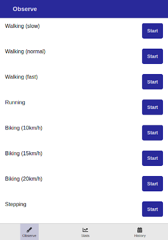

# calendar4d-mobapp

Calendar4d is a react-native application to measure the time spent in different activities.

This is the frontend of the application, made with react-native, expo, ...

## Screenshots

| Stopwatches        |
|:-------------:|
|  |


## Dev environment

- Install nodejs
- Install expo

## Dependencies

To compile, you'll need to clone ezwn-ux-native, ezwn-storage-native, ezwn-react-app and ezwn-react-app-ux-native (available from my github) into the lib folder:

```
cd lib
git clone https://github.com/ezwn/ezwn-ux-native.git
git clone https://github.com/ezwn/ezwn-storage-native.git
git clone https://github.com/ezwn/ezwn-react-app.git
git clone https://github.com/ezwn/ezwn-react-app-ux-native.git
git clone https://github.com/ezwn/ezwn-react-native-session.git
git clone https://github.com/ezwn/ezwn-react-native-data-mng-lang.git
```

## Development

```
npm start
```

## Project organization

See lib/ezwn-react-app/README.md.

## The author

This project has been developed by Nicolas Enzweiler.

E-Mail address: [logiboost@gmail.com](mailto:logiboost@gmail.com)

Github : [https://github.com/ezwn](https://github.com/ezwn)
